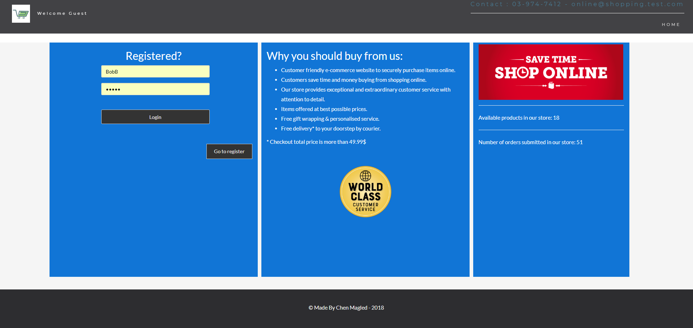
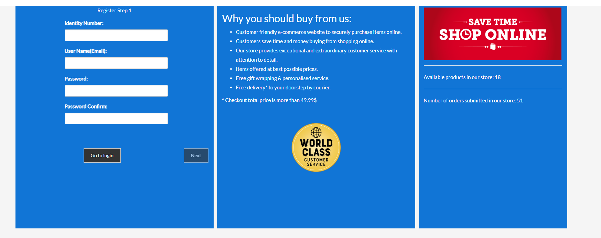
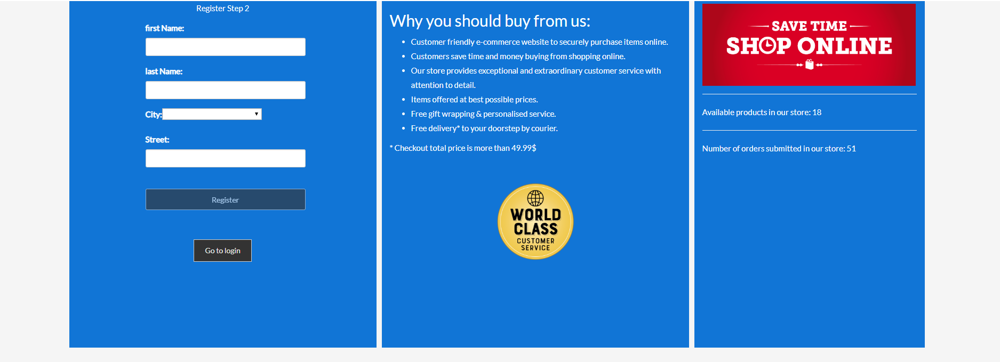
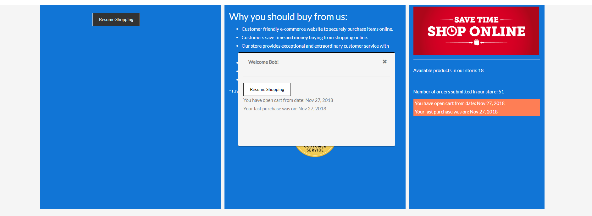
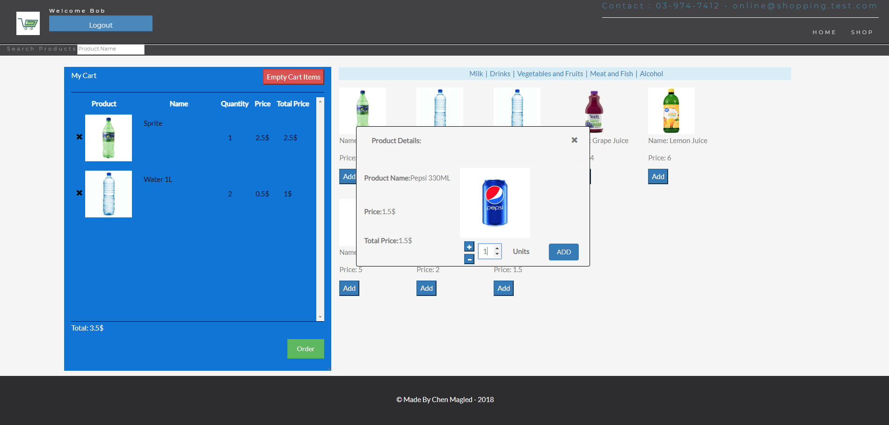
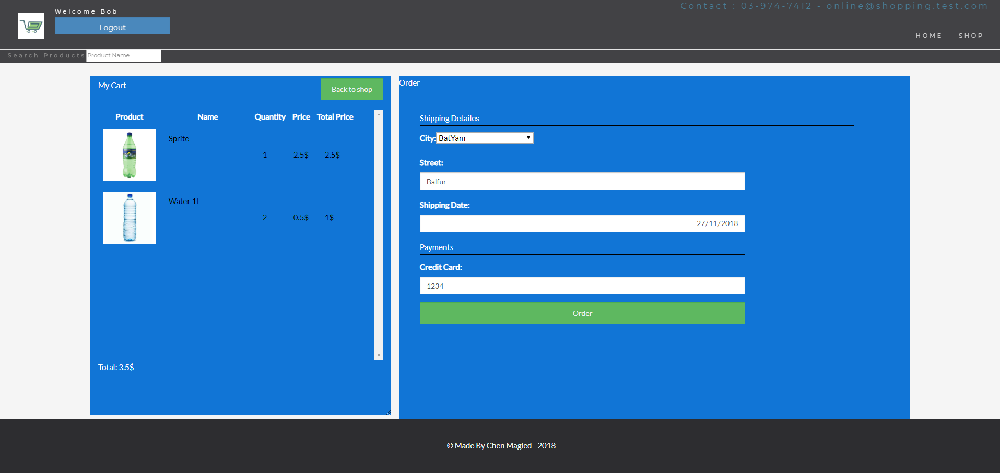
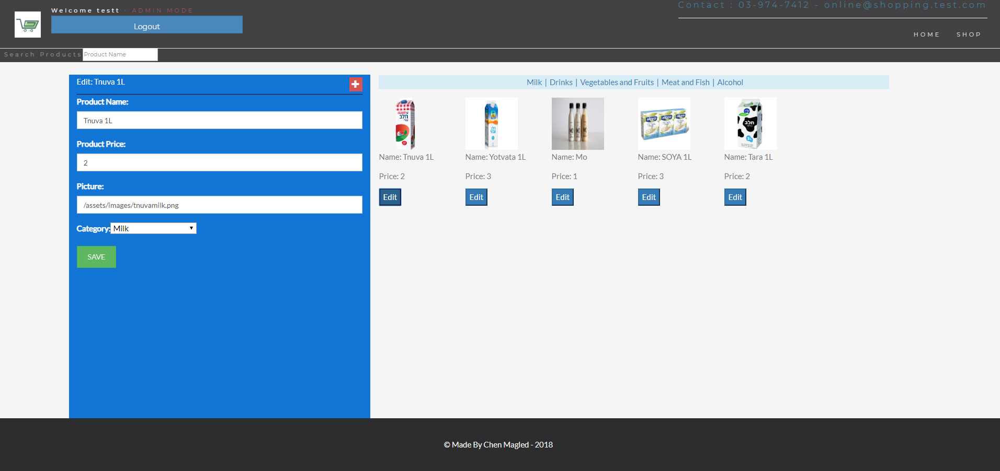

# LIVE DEMO: https://sleepy-plains-48411.herokuapp.com

# Shopping Online
* Online shopping store

* Login & Register for customers.
* Products list and user cart items
* Create order and get receipt as file
* Admin: Create and edit products

## topics:

### HTML + CSS :
* HTML5 Structre
* Bootstrap Design

### Angular

### NodeJS :

1. Mogoose(MongoDB)
2. Express(Server)

### MongoDB

- Design & Create collections (user, products, cart, cartItems, orders, cities, categories )

***

## Requirements:

1. NPM: jsonwebtoken, express, mongoose, body-parser, nodemon
2. NodeJS, Angular.

## How to run:

 nodemon ./server/01_controllers/index.js

 Create admin user: Create user with the username: manager or set user role to 1.

***

### Home Page:

### Register Step One:

### Register Step Two:

### Customer Login Successful:

### Add Item To Cart / Products List:

### Order Page:

### Order Receipt:

### Admin Edit/Add products page:

